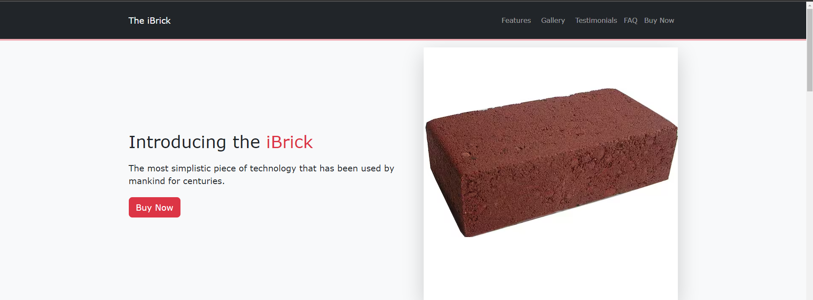

# The iBrick

This repository contains the code for a static webpage that features a fictional product called "The iBrick." It was written using Bootstrap 5, and it is fully responsive. The webpage is divided into multiple sections, each of which is styled using Bootstrap's utility classes. You can view the live version of the webpage <a href="" target="_blank">here</a>.